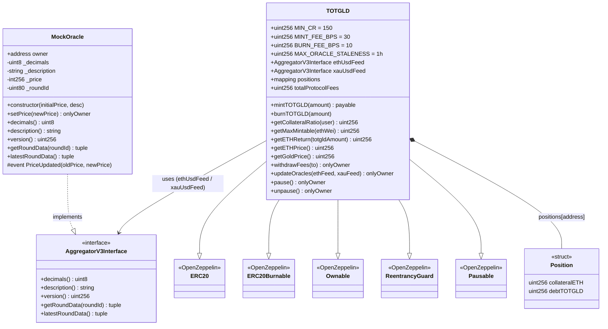
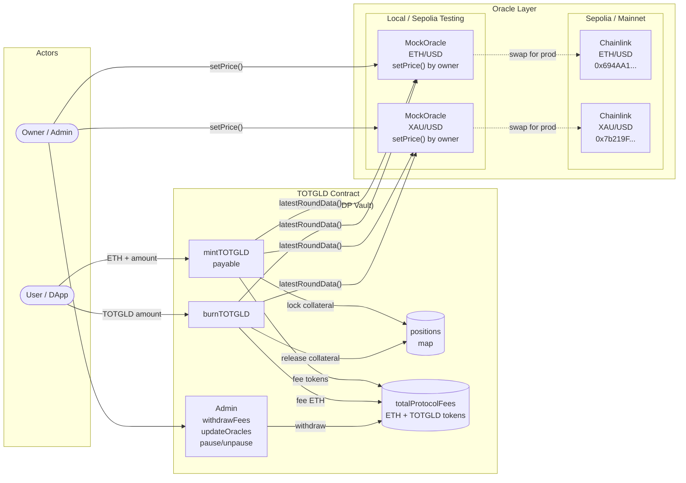
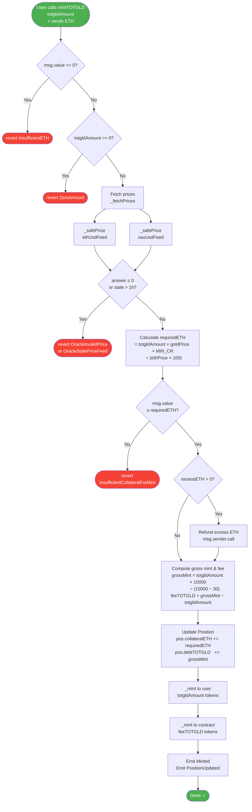
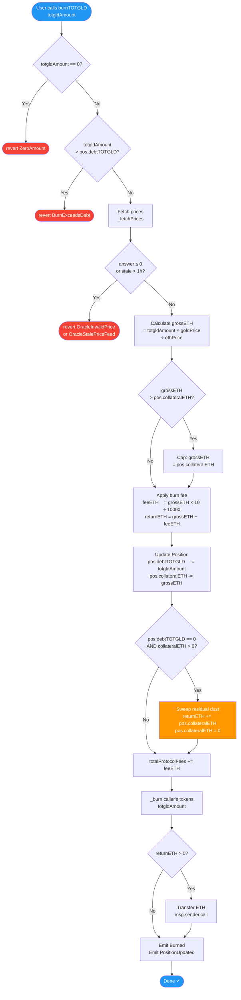
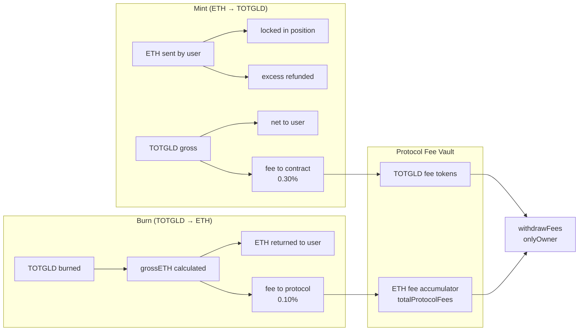

# TOTGLD System & Flow Diagrams

> Generated from `Smart contract/TOTGLD.sol` and `Smart contract/MockOracle.sol`

---

## 1. System Architecture (Class Diagram)

Shows contract inheritance, interfaces, and relationships.



---

## 2. High-Level System Overview

Shows actors, contracts, and oracle deployment strategies.



---

## 3. `mintTOTGLD()` Flow



### Mint Formula Reference

| Variable | Formula |
|---|---|
| `requiredETH` | `totgldAmount × goldPrice × 150 ÷ (ethPrice × 100)` |
| `grossMint` | `totgldAmount × 10000 ÷ (10000 − 30)` |
| `feeTOTGLD` | `grossMint − totgldAmount` (≈ 0.30%) |
| User receives | `totgldAmount` tokens |
| Protocol retains | `feeTOTGLD` tokens |

---

## 4. `burnTOTGLD()` Flow



### Burn Formula Reference

| Variable | Formula |
|---|---|
| `grossETH` | `totgldAmount × goldPrice ÷ ethPrice` (capped at `collateralETH`) |
| `feeETH` | `grossETH × 10 ÷ 10000` (≈ 0.10%) |
| `returnETH` | `grossETH − feeETH` |
| Protocol retains | `feeETH` wei |

---

## 5. MockOracle — `setPrice()` & Data Flow

```mermaid
sequenceDiagram
    participant Owner
    participant MockOracle
    participant TOTGLD

    Note over MockOracle: Deployed with initialPrice & desc
    Owner->>MockOracle: setPrice(newPrice)
    MockOracle->>MockOracle: require(newPrice > 0)
    MockOracle->>MockOracle: emit PriceUpdated(old, new)
    MockOracle->>MockOracle: _price = newPrice; _roundId++

    Note over TOTGLD: On mintTOTGLD / burnTOTGLD
    TOTGLD->>MockOracle: latestRoundData()
    MockOracle-->>TOTGLD: (_roundId, _price, block.timestamp, block.timestamp, _roundId)
    TOTGLD->>TOTGLD: validate: answer > 0, not stale
```

---

## 6. Collateral & Fee Summary



---

## Key Constants

| Constant | Value | Meaning |
|---|---|---|
| `MIN_CR` | 150 | 150% minimum collateral ratio |
| `MINT_FEE_BPS` | 30 | 0.30% mint fee |
| `BURN_FEE_BPS` | 10 | 0.10% burn fee |
| `MAX_ORACLE_STALENESS` | 3600s | Oracle data must be < 1 hour old |
| `PRICE_PRECISION` | 1e8 | Chainlink 8-decimal price scale |
